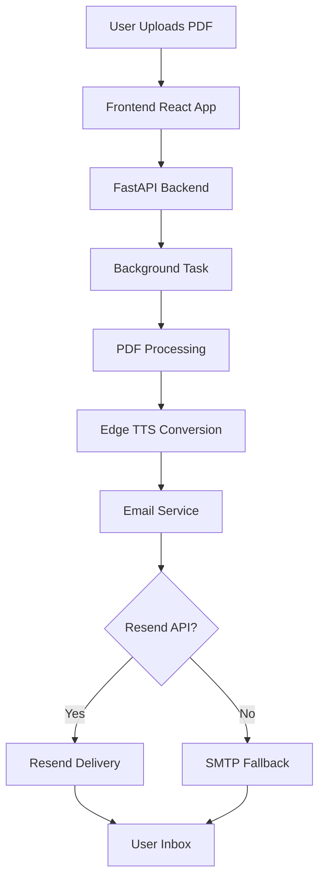

# 🔊 SonifyReads

**Transform Your Reading into Listening Experience**

[](https://opensource.org/licenses/MIT)
[](https://fastapi.tiangolo.com/)
[](https://reactjs.org/)
[](https://github.com/rany2/edge-tts)

## 🌟 **Welcome to the Future of Reading**

SonifyReads is an innovative AI-powered platform that transforms your PDF documents into high-quality audio files. Perfect for busy professionals, students, and anyone who wants to consume written content on the go. Upload your PDF, and we'll send you a professionally narrated audio version straight to your inbox!


## ✨ **Features That Will Amaze You**

### 🎯 **Smart Document Processing**
- **Intelligent Text Extraction**: Cleans and processes PDF content intelligently
- **Front Matter Detection**: Automatically skips copyright pages, tables of contents, and dedications
- **Natural Speech Patterns**: Chunking algorithm maintains natural sentence flow

### 🎙️ **Premium Audio Quality**
- **Microsoft Edge TTS**: Uses state-of-the-art neural voices (`en-US-GuyNeural`)
- **Professional Narration**: Natural-sounding speech with proper intonation
- **Optimized Processing**: Sequential chunk processing for reliable conversion

### 📧 **Convenient Delivery**
- **Email Integration**: Receive audio files directly in your inbox
- **Dual Email Backends**: Resilient delivery with Resend API + SMTP fallback
- **Beautiful Templates**: Professional HTML email with file attachment

### 🛡️ **Enterprise-Grade Reliability**
- **Render-Safe Architecture**: Optimized for cloud deployment
- **Concurrent Processing**: Semaphore-controlled TTS operations
- **Automatic Cleanup**: Temporary file management and resource cleanup

## 🚀 **Quick Start**

### **Prerequisites**
- Python 3.9+
- Node.js 16+
- Edge TTS dependencies
- Resend API key (recommended) or SMTP credentials

### **Backend Setup**

1. **Clone the repository**
```bash
git clone https://github.com/imHardik1606/sonifyreads.git
cd sonifyreads
```

2. **Set up Python environment**
```bash
python -m venv venv
source venv/bin/activate  # On Windows: venv\Scripts\activate
pip install -r requirements.txt
```

3. **Run the backend server**
```bash
uvicorn main:app --reload --host 0.0.0.0 --port 8000
```

### **Frontend Setup**

1. **Navigate to frontend directory**
```bash
cd frontend
```

2. **Install dependencies**
```bash
npm install
# or
yarn install
```

3. **Configure environment**
```bash
cp .env.example .env.local
# Set NEXT_PUBLIC_API_URL to your backend URL
```

4. **Start development server**
```bash
npm run dev
# or
yarn dev
```

I'll add a "Future Features" section and enhance the current features with a roadmap for multiple voice options. Here's the updated README section:

## 🚀 **Future Features Roadmap**

We're constantly improving SonifyReads! Here's what's coming next:

### **🎭 Multiple Voice Options (Planned for Q2 2024)**
We're expanding our TTS capabilities to offer a wide range of voices:

| Feature | Status | Description |
|---------|--------|-------------|
| **Gender Options** | 🔄 In Development | Male, female, and neutral voices |
| **Language Support** | 📅 Planned | 40+ languages including Spanish, French, German, Japanese |
| **Accent Selection** | 📅 Planned | Regional accents (UK, AU, US, IN English) |
| **Voice Customization** | 💡 Proposed | Pitch, speed, and tone adjustments |
| **Celebrity Voices** | 💭 Future | Licensed celebrity voice options |

## 📚 **How It Works**

### **1. Upload Your PDF**
Simply drag and drop your PDF file onto our beautiful web interface. We support files up to 50MB with intelligent validation.

### **2. Enter Your Email**
Provide your email address where you'd like to receive the audio file. We'll handle all the processing in the background.

### **3. AI Magic Happens**
Our backend:
- Extracts and cleans text from your PDF
- Uses Microsoft Edge TTS for natural speech synthesis
- Optimizes audio quality and file size
- Securely attaches the file to an email

### **4. Receive & Enjoy**
Check your inbox for a professionally formatted email containing your audio file. Listen on any device!

## 🏗️ **Architecture**



### **Tech Stack**

| Layer | Technology | Purpose |
|-------|------------|---------|
| **Frontend** | React + TypeScript | Modern, type-safe UI |
| **Backend** | FastAPI | High-performance API |
| **TTS Engine** | Edge TTS | Natural speech synthesis |
| **Email** | Resend API | Reliable delivery |
| **PDF Processing** | PyMuPDF | Text extraction |
| **Styling** | Tailwind CSS | Responsive design |

<!-- ## 📊 **Performance Metrics**

| Metric | Value | Description |
|--------|-------|-------------|
| **Max File Size** | 50MB | Upload limit |
| **Processing Time** | ~1 min/10 pages | Varies by content |
| **TTS Concurrency** | 2 | Render-safe limit |
| **Characters per Chunk** | 3500 | Optimal for TTS |
| **Email Retry** | Dual backend | Resend + SMTP | -->

## 🤝 **Contributing**

We love contributions! Here's how you can help:

1. **Fork the repository**
2. **Create a feature branch**
```bash
git checkout -b amazing-feature
```
3. **Make your changes**
4. **Run the app**
```bash
npm run dev # Frontend
uvicorn main:app --reload # Backend
```
5. **Submit a pull request**

### **Areas for Contribution**
- 🎨 UI/UX improvements
- 🔊 Additional TTS voices/languages
- 📱 Mobile app development
- 🔧 Performance optimizations
- 🧪 Test coverage expansion

## 📄 **License**

This project is licensed under the MIT License - see the [LICENSE](LICENSE) file for details.

## 🙏 **Acknowledgments**

- **[Microsoft Edge TTS](https://github.com/rany2/edge-tts)** for the amazing text-to-speech engine
- **[FastAPI](https://fastapi.tiangolo.com/)** for the incredible web framework
- **[Resend](https://resend.com/)** for reliable email delivery
- **[Tailwind CSS](https://tailwindcss.com/)** for the beautiful styling system
- **[React](https://reactjs.org/)** for the powerful frontend library

## 🌟 **Show Your Support**

If you find this project useful, please give it a star! ⭐

## 📬 **Contact & Support**

- **Issues**: [GitHub Issues](https://github.com/yourusername/sonifyreads/issues)
- **Email**: support@sonifyreads.com
- **Twitter**: [@SonifyReads](https://twitter.com/SonifyReads)
- **Discord**: [Join our community](https://discord.gg/sonifyreads)

---

<div align="center">
  <h3>Made with ❤️ for readers everywhere</h3>
  <p>Because every story deserves to be heard</p>
  
  [](https://star-history.com/#yourusername/sonifyreads&Date)
</div>

---

**Happy Listening! 🎧**